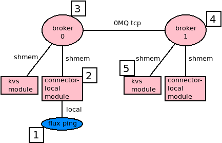

.. github display
   GitHub is NOT the preferred viewer for this file. Please visit
   https://flux-framework.rtfd.io/projects/flux-rfc/en/latest/spec_12.html

#################################
12/Flux Role-based Access Control
#################################

This document describes the how Flux message credentials are used to
secure access to services.

-  Name: github.com/flux-framework/rfc/spec_12.rst

-  Editor: Jim Garlick <garlick@llnl.gov>

-  State: raw

********
Language
********

The key words "MUST", "MUST NOT", "REQUIRED", "SHALL", "SHALL NOT", "SHOULD",
"SHOULD NOT", "RECOMMENDED", "MAY", and "OPTIONAL" in this document are to
be interpreted as described in `RFC 2119 <https://tools.ietf.org/html/rfc2119>`__.

*****************
Related Standards
*****************

- :doc:`3/Flux Message Protocol <spec_3>`

- :doc:`6/Flux Remote Procedure Call Protocol <spec_6>`

- :doc:`15/Independent Minister of Privilege for Flux: The Security IMP <spec_15>`

- :doc:`39/Flux Security Signature <spec_39>`

*****
Goals
*****

- Define valid message credentials.

- Define how message credentials are assigned and propagated.

- Describe how message credentials are used to protect services against
  unauthorized access in a multi-user Flux instance.

- Describe pub/sub message privacy.

**********
Background
**********

A *Flux instance* consists of one or more Flux brokers communicating over a
tree-based overlay network.  Most of Flux's distributed systems and services
that aren't directly associated with a running job are embedded in the Flux
broker executable or its dynamically loaded plugins.  Brokers run as an
unprivileged user referred to as the *instance owner*.  The instance owner
has complete control within the Flux instance.

In a single-user Flux instance, only the instance owner is permitted to
connect to Flux and send messages.  Jobs are launched directly by Flux
brokers and all jobs run as the instance owner.  An example of single user
Flux instance is a Flux batch job.

In a multi-user Flux instance, the instance owner is typically the ``flux``
system user and *guest* users are permitted connect to Flux and send messages.
Jobs are launched indirectly by a privileged helper called the IMP.  Security
in a multi-user Flux instance may be decomposed into two main topics:

#. Job requests are signed by guest users (RFC 39) and validated by a
   privileged helper called the IMP (RFC 15), which launches work on the
   guest's behalf.

#. Messages sent by guest users are stamped at ingress with a credential that
   may be checked by Flux services to limit guest access.

This RFC describes how message credentials are used to implement role-based
access control in a multi-user Flux instance.

**************
Implementation
**************

.. note::
  Flux credentials use numerical POSIX user IDs.  It is assumed that all users
  accessing Flux have a consistent UID mapping across participating systems.

Credential
==========

The Flux message credential consists of (*userid*, *rolemask*) tuple as
described in RFC 3.

The *userid* is a 32 bit unsigned integer that SHALL be interpreted as the
message sender's POSIX User ID.

The *rolemask* is a 32 bit mask that SHALL be interpreted as a set of
capabilities.

A newly allocated message SHALL be initialized with an invalid credential,
specifically (``0xffffffff``, ``0``).

In a valid credential, the userid SHALL be set to any value other than
``0xffffffff`` and the rolemask SHALL include one of the following roles:

FLUX_ROLE_OWNER (``1``) SHALL confer the maximum privilege upon the user, and is
REQUIRED to be assigned to the instance owner.

FLUX_ROLE_USER (``2``) SHALL confer guest access.

Additional roles MAY be added to the rolemask:

FLUX_ROLE_LOCAL (``4``) SHALL indicate that the sender is attached to the
same broker rank as the receiver (see below).

Guest Authentication
====================

Unless explicitly configured, guests SHALL NOT be permitted to connect directly
to any component of a Flux instance.

As noted in RFC 3, connections from the local connector's UNIX domain socket
are authenticated using the SO_PEERCRED socket option.  A connection SHALL
be assumed to be from the instance owner if its peer UID matches the return
value of ``getuid(3)`` when the acceptor is known to be running as the
instance owner.

Flux brokers are interconnected via a tree-based overlay network that uses
0MQ's ``tcp://`` and ``ipc://`` socket types.  Overlay network security is
outsourced to 0MQ.  For this RFC, it is sufficient to note that guests SHALL
NOT be permitted to directly connect to the overlay network, therefore all
overlay network peers MAY be assumed to be running as the instance owner.

Credential Assignment
=====================

When a message is received from a peer known to be the instance owner:

- If the message credential is invalid, it SHALL be set to (*owner_userid*,
  FLUX_ROLE_OWNER).

- If the message credential is valid, it SHALL NOT be changed.

When a message is received from a peer authenticated as a guest:

- If the guest user ID is 0 and the instance has been explicitly configured
  to allow root to act as the instance owner, then the credential SHALL be
  set to (*owner_userid*, FLUX_ROLE_OWNER).

- Otherwise the credential SHALL be set to (*guest_userid*, FLUX_ROLE_USER).

.. note::
  Although the natural flow is to send messages with invalid credentials
  and allow the initial receiver to assign them, a consequence of the
  credential assignment rules above is that the instance owner is permitted
  to assign any valid credential to a message *before* sending, and thus
  impersonate a guest.  This is useful for testing and not harmful since
  the the owner already has complete control over the Flux instance.

The Local Role
==============

FLUX_ROLE_LOCAL is special in that it is not a capability assigned to the user.
Rather, it reflects whether the message was sent from the same broker rank as
the receiver.  It MAY be used to limit remote access to sensitive services such
as ``rexec``, even for the instance owner.

FLUX_ROLE_LOCAL is managed as follows:

- When a credential is assigned, FLUX_ROLE_LOCAL SHALL be added to the message
  rolemask if the connection is local (e.g. the local and shmem connectors).

- When a message is received by the overlay network from a remote broker,
  FLUX_ROLE_LOCAL SHALL be cleared from the message rolemask.

Service Security Policy
=======================

The Flux broker routes all requests addressed to a registered service to
their destinations as per RFC 6, without regard for the message credentials.
Flux services that act upon request messages MUST assume that requests can
be received from guests and implement appropriate protections.

When a request message is denied because of inadequate credentials, and
the request does not have the FLUX_MSGFLAG_NORESPONSE flag, the service
SHOULD respond with the POSIX EPERM (1) error.

Role-based access control MAY be implemented by associating an "allow" rolemask
with each service.  A message is accepted if one of the following is true

- a logical *AND* is performed between the message credential rolemask and
  the allow rolemask and the result is nonzero

- the message credential contains FLUX_ROLE_OWNER

Messages that fail role based access control receive an automatic EPERM error.
Messages that pass reach the service message handler callback.

Once the message handler is called, the message handler MAY implement further
checks on the message credential.  For example, some services allow
FLUX_ROLE_USER, then accept messages if one of the following is true

- the message credential contains FLUX_ROLE_OWNER

- the message credential userid matches a target userid  (for example a job
  owner).

Event Privacy
=============

RFC 3 describes Flux's publish-subscribe event messages.  Some event messages
MAY be inappropriate to share with all users in a multi-user Flux instance.

The credential assignment rules described above apply equally to requests
and event messages.  When an event is published with the FLUX_MSGFLAG_PRIVATE
flag, event message publication SHALL only be performed to a peer if one of
the following is true:

- the peer is known to be the instance owner

- the peer's authenticated userid matches the event message credential userid

Request Example
===============

   A guest user runs ``flux ping -r 1 kvs``.

It may be helpful to trace the path of a request message sent by a guest to
a service on another broker rank.

#. The ``flux ping`` command connects to Flux as a guest user with POSIX UID
   of ``5500`` and sends a request message to the KVS module on rank 1.
   The request message has an invalid credential (``0xffffffff``, ``0``).

#. The Flux instance's connector-local broker module is configured to allow
   guests, so the connection is permitted.  Because the connection is
   authenticated as a guest and the connection is local, the credential
   (``5500``, FLUX_ROLE_USER | FLUX_ROLE_LOCAL) is assigned and the message
   is forwarded to the next hop, broker 0.

#. Broker 0 knows that the connector-local module, which is a local thread
   communicating over shared memory, is running as the instance owner, so the
   message is forwarded as-is to the next hop, broker 1, using the overlay
   network.

#. Broker 1 knows that the overlay network only connects remote brokers
   running as the instance owner, so it clears FLUX_ROLE_LOCAL and forwards
   the message to the local kvs module.

#. The KVS module knows that the broker is running as the instance owner so
   it accepts the request as-is.  The request credential (``5500``,
   FLUX_ROLE_USER) is compared against the allow rolemask for ``kvs.ping``,
   which contains FLUX_ROLE_USER, and the request is accepted and processed.
