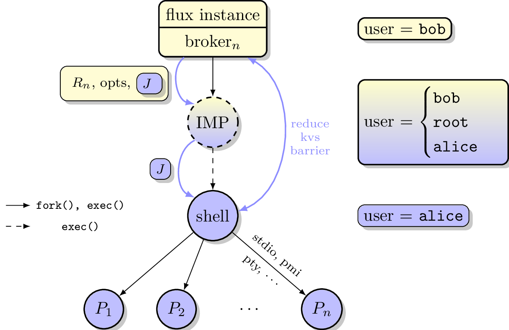

.. github display
   GitHub is NOT the preferred viewer for this file. Please visit
   https://flux-framework.rtfd.io/projects/flux-rfc/en/latest/spec_15.html

15/Independent Minister of Privilege for Flux: The Security IMP
###############################################################

This specification describes Flux Security IMP, a privileged service
used by multi-user Flux instances to launch, monitor, and control
processes running as users other than the instance owner.

.. list-table::
  :widths: 25 75

  * - **Name**
    - github.com/flux-framework/rfc/spec_15.rst
  * - **Editor**
    - Mark A. Grondona <mgrondona@llnl.gov>
  * - **State**
    - raw

Language
********

.. include:: common/language.rst

Related Standards
*****************

- :doc:`spec_12`
- :doc:`spec_38`

Introduction
************

In the traditional resource management model, a monolithic resource
manager runs with the credentials of a privileged user, typically using
long-running daemons with elevated privileges on compute resources. These
daemons allow the resource manager to complete necessary privileged
work, such as modification of containers, system preparation (such as
prolog/epilog scripts), and most importantly allow the transition of
credentials to that of the requesting user, so that jobs may be successfully
executed in a multi-user environment.

Drawbacks to this monolithic approach include:

-  Total amount of code running with privilege is increased above what
   is strictly necessary

-  Testing of privileged code is more difficult

-  Security patches and updates require a new release of entire project

In the Flux model, however, an instance runs at most with the credentials
of the *instance owner* (a normal, unprivileged user), including all
processes running on computational resources of the instance. This design
works well for single-user instances of Flux, but multi-user capable
instances require some mechanism to perform privileged operations, most
notably when executing work on behalf of a non instance owner (a guest).

In the Flux system, this privilege - along with all related operations - is
contained within a single service, the *Independent Minister of Privilege*
(IMP), which is responsible for allowing instance owners to run work on
behalf of a guest when the guest user has authorized the instance to do so.

By placing all code running with elevated privilege into a single service,
the following benefits are realized:

-  Code running under privilege is reduced to the logical minimum

-  The privileged service can be tested separately from other Flux components

-  The privileged software release cycle is decoupled from core
   Flux code, allowing updates to be applied out of band.

-  The privileged service is completely under sysadmin control, while
   still allowing users to run test or private versions of Flux even
   in multi-user mode.

-  More fine grained administrative control of privilege. For example,
   simple filesystem access controls may be used to limit which
   users are allowed to run multi-user without preventing these users
   from launching Flux instances altogether.

-  Arbitrary users can run multi-user instances of Flux, thus allowing
   users to share their jobs

User Roles
==========

For the purposes of this RFC there are four main user roles:

owner, instance owner, or resource owner
   The user under which a Flux instance is running, not privileged.
   This user is considered the owner of all resources to which the Flux
   instance is running.

system owner
   The user under which the system instance of Flux is running.
   The default owner of all resources on the system.

guest user, or guest
   A user wishing to use services or run work in a Flux instance when
   they are not the instance owner.

superuser, or root
   A user with access to perform required privileged operations during
   multi-user execution, such as gaining credentials of other users,
   system setup or initialization, container manipulation, etc. Typically
   the root user.

Implementation Requirements
===========================

The Flux Security IMP SHALL be implemented with the following overall
design

-  The IMP SHALL be an independent Flux Framework project, with the ability
   to be tested standalone

-  The IMP SHALL be implemented as an executable, :program:`flux-imp`,
   which MAY be installed with setuid permissions in cases where multi-user
   Flux is required.

-  The IMP SHALL avoid putting sensitive data on the command line or
   environment.

Implementation of the IMP as a separately installed, setuid executable
allows sysadmin control over where and how the IMP is enabled. If the
:program:`flux-imp` executable is not installed, or installed without
setuid bits enabled, then multi-user Flux is simply not available, though
single user instances of Flux will still operate. The file permissions,
access controls, or SELinux policy of :program:`flux-imp` may also be
manipulated to restrict access to a user or group of users. For instance,
a site may configure permissions such that only a ``flux`` user has execute
permissions, thus allowing a multi-user system instance running as ``flux``,
but disallowing sub-instance jobs access to multi-user capabilities.

Overall Design
==============

When a guest makes a request for a job to a multi-user instance of
Flux, the guest will create a message with information such as the job
specification, a time-to-live, a uid, and an authorized resource owner,
and then uses IMP client API to sign all fields of the message. The signed
message becomes the user request token :math:`J` which authorizes the resource
owner to execute the request at some point on behalf of the guest.

This signed request then becomes part of the user’s job. When the job is
scheduled by the instance, the owner assigns a resource set :math:`R` to
the job, and writes that information to the job record, marking the job as
runnable.

The execution system within the instance then determines the set of
resources on which an invocation of the IMP is required and creates
a local resource set :math:`R_{local}`, which is necessarily disjoint for
each IMP, and acts as a representation of the local resources to which
the IMP should grant access to the guest user.

:math:`R_{local}` and :math:`J`, along with other optional fields,
are then concatenated and become input to the Flux IMP executable.
The IMP verifies through local configuration and state that the
instance owner has authority to grant access to resources in the
local resource set, and verifies via :math:`J` that the guest has
authorized the resources owner to execute specific work on their
behalf.

The IMP verifies the integrity and authenticity of :math:`J`
using cryptographic methods provided by plugins. Once the verification
step is complete, the privileged IMP will invoke system configured
plugins for setup and containment, then change credentials to the
guest user, and finally execute the processes of the job as specified
in :math:`J`.

In most cases, the IMP will execute a *job shell* on behalf of the user,
passing the verified :math:`J` as input to the shell. The shell itself is
specified either by the user in :math:`J` or by IMP configuration, but
should not be provided or modified by the instance owner. The shell re-verifies
integrity and authenticity of :math:`J` before proceeding, then interprets
the jobspec contained in :math:`J` to determine the set of tasks to invoke
on the current resource set.

.. note::

   It may be noted that the user’s request :math:`J` is verified twice when a job
   shell is invoked, and this is by design. The IMP verifies :math:`J` to avoid
   passing tainted input to the job shell, which runs as the guest user.
   The shell re-verifies :math:`J` because it has no guarantee that the caller
   has already done this verification, or that :math:`J` has not been changed
   since any past verification.

Figure 1 below summarizes the overall role of the IMP in a multi-user
Flux instance.

   Depiction of multi-user Flux IMP overall design. Here user ``bob`` is the instance owner, and ``alice`` is a guest.

Input to the IMP
****************

The input to the IMP includes the following fields

-  Local assigned resource set (:math:`R_{local}`)

-  Options supplied by resource owner

-  User Request (:math:`J`) (described below)

Where :math:`J` is the User Request or reference to such a request,
which SHALL contain

-  Jobspec as per :doc:`14/Canonical Job Specification <spec_14>`

-  Options supplied by guest user

-  Guest user uid or username

-  Job shell path

-  UUID

-  Timestamp and TTL

-  Intended recipient (instance owner)

-  Allowed resource set

-  User signature (of above fields)

Where above fields have the following specific meanings and requirements

-  *Local assigned resource set* is the list of **local** resources assigned
   to this job by the resource owner. It will be used by IMP plugins to
   implement containment.

-  *Timestamp and TTL* signifies that the request in question SHALL
   only be valid between *Timestamp* and *Timestamp+TTL*. This puts a
   time horizon on usage of :math:`J`.

-  *UUID* is a globally unique identifier

-  *Intended recipient* is set to the instance owner that is the target
   of the request. This ensures that the user’s request cannot be
   used by another arbitrary user.

-  The *user signature* signs all fields of :math:`J`.

-  The *job shell path* is an absolute path to a job shell which
   will act as interpreter of the Jobspec in :math:`J`. If missing, a default
   will be supplied by IMP configuration.

IMP Internal Operation
**********************

Privilege Separation
====================

When the IMP is invoked *and* has setuid privileges, the process MAY
use privilege separation to limit the impact of programming errors or
bugs in libraries. For more information on privilege separation, see
the paper on privilege separated OpenSSH: "Preventing Privilege
Escalation"  [#f1]_.

Request Verification
====================

Once the privileged IMP process has read its input
it SHALL perform the following verification steps:

1. Verify integrity and authenticity of :math:`J`

2. Verify recipient field in :math:`J` matches current real UID of the IMP
   (i.e. the resource owner)

3. Verify TTL on :math:`J`

The IMP process MAY also perform the following OPTIONAL verification steps:

-  Verify that the current real UID of the IMP process is the "owner"
   of the current container.

-  Verify that the intersection of the assigned resource set and the
   current container is not empty.

Container ownership verification is considered optional because all
non-system-owner processes in Flux MUST be started by the IMP and
thus will be placed in inescapable containers. It thus follows that
a user running the IMP has ownership of the resources on which the
IMP has been invoked. This strategy is described further in the
"Resource ownership verification" section below.

Determining the intersection of the assigned resource with the current
resource set is considered optional because this check will be a side
effect of sub-container creation. If, after all container creation
plugins have been run, the container for the job is empty, the IMP
will abort with an error. Therefore an initial verification check
may be redundant.

Resource ownership verification
-------------------------------

Resources in Flux are initially owned by the *system owner*, i.e. the
user which runs the system instance. Typically, this would be some
special system user, e.g. ``flux``. The system owner is the only trusted
user and resource ownership of requests from this user SHALL NOT require
verification.

In order to verify resource ownership for non-system users, the
following requirements should be met:

-  The IMP SHALL support some sort of containment strategy, implemented
   via plugins for maximum flexibility.

-  The IMP’s container mechanism MUST support, at a minimum, process
   tracking functionality capable of creating inescapable process groups.

-  The IMP’s container strategy MUST be hierarchical, such that containers
   for jobs within an instance are created as sub-containers of
   container of the parent.

With the following requirements met, the IMP may verify resource
ownership by ensuring that the current container includes the
resources in the assigned resource set, and that the invoking user
is owner of the current container.

Revoking resource ownership
---------------------------

Resource ownership MUST be revokable. The result of a revocation SHALL
include termination of all processes currently running in the container
associated with the revoked resource grant. A revocation is recursive,
and removes the container and all child containers, including ancillary
data.

IMP post-verification execution
===============================

After verification of input is complete, the :program:`flux-imp` executable
invokes required job setup code as the superuser. This setup code MAY
be implemented as system-installed and verified plugins, and MAY include
such things as

-  Start a PAM session on behalf of the guest

-  Execution of some sort of job prolog

-  modification of system settings

-  creation of directories

-  state cleanup

-  optional behavior

Once privileged setup is complete, the security IMP SHALL generate a log
message or other audit trail for the individual request. The IMP then
SHALL spawn the **job shell path** specified in :math:`J`, or a IMP
configuration default with the guest user credentials.

The IMP MUST remain active while the job shell executes and forward any
signals it receives to the shell as described below.  Once the job shell has
terminated, the IMP MAY perform privileged clean-up tasks such as

-  Finalize the PAM session

Other IMP operational requirements
==================================

A multi-user instance of Flux not only requires the ability to execute
work as a guest user, but it must also have privilege to monitor and
kill these processes as part of normal resource manager operation.

Signal Handling
---------------

The IMP runs with an effective user ID of root and a real user id of the
system instance owner, thus the system instance owner is permitted to signal
the IMP.  In contrast, the system instance owner is not permitted to signal
guest user processes.

To enable the instance owner to signal guest jobs, the IMP SHALL act
as a proxy for the job by trapping common signals and forwarding them to
the job shell.

To enable the instance owner to fully clean up when the job shell is unable
to do so, the IMP SHALL handle SIGUSR1 as a surrogate for SIGKILL.  Upon
receipt of this signal, the IMP SHOULD deliver SIGKILL to all processes in
the job's container, including the job shell.

The IMP SHALL get the basename of the current cgroup directory at startup.
If the directory begins with ``imp-shell``, then the IMP SHALL deliver SIGKILL
to all PIDs listed in ``cgroup.procs``. Otherwise, the IMP SHALL deliver
SIGKILL only to its direct child and optionally MAY include descendants.

IMP configuration
=================

On execution, :program:`flux-imp` SHALL read a site configuration
file which MAY contain site-specific information such as paths to trusted
executables, plugin locations, certificate authority information etc.
The IMP SHALL check for correct permissions on all configuration
files to reduce the risk of tampering.

Specific Defenses
=================

This section describes some attacks and their specific defenses. It
is still a work in progress.

-  *Executing arbitrary process as another user*: The entirety of a user
   job request, including executables, arguments, working directory,
   environment variables, etc, has an integrity guarantee, therefore
   a request cannot be forged, even by the instance owner.

-  *Replay attacks*, where a user’s job request is run again without their
   express permission, or a request is taken to another system and executed
   without authority. The *intended recipient* field of the user request
   protects against users other than the instance owner using the
   guest request, and a fixed time-to-live prevents the request from
   being used indefinitely. Finally, :program:`flux-imp`` logs all
   invocations, thereby allowing replays to be detected and audited.

References
**********

.. [#f1] `Preventing Privilege Escalation <https://www.usenix.org/legacy/events/sec03/tech/full_papers/provos_et_al/provos_et_al.pdf>`__, Niels Provos, Markus Friedl, Peter Honeyman.
