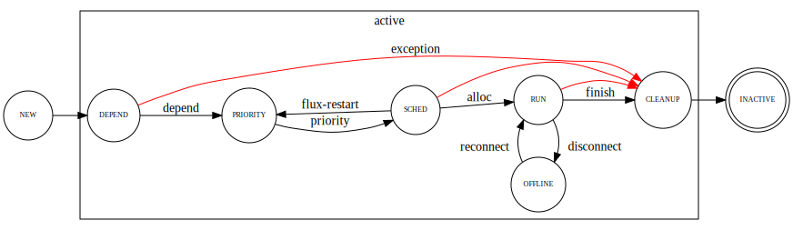

.. github display
   GitHub is NOT the preferred viewer for this file. Please visit
   https://flux-framework.rtfd.io/projects/flux-rfc/en/latest/spec_21.html

21/Job States and Events
========================

This specification describes Flux job states and the events that trigger
job state transitions.

-  Name: github.com/flux-framework/rfc/spec_21.rst

-  Editor: Jim Garlick <garlick@llnl.gov>

-  State: raw

Language
--------

The key words "MUST", "MUST NOT", "REQUIRED", "SHALL", "SHALL NOT", "SHOULD",
"SHOULD NOT", "RECOMMENDED", "MAY", and "OPTIONAL" in this document are to
be interpreted as described in `RFC 2119 <https://tools.ietf.org/html/rfc2119>`__.

Related Standards
-----------------

-  :doc:`16/KVS Job Schema <spec_16>`

-  :doc:`18/KVS Event Log Format <spec_18>`

-  :doc:`22/Idset String Representation <spec_22>`

-  :doc:`27/Flux Resource Allocation Protocol Version 1 <spec_27>`

Background
----------

The job state machine is intended to be a useful abstraction of job life
cycle for users. If a job is not yet running, the job state communicates
at a high level what it is waiting for. In addition to being available to
query, job states may also be used as a basis for synchronization by tools
such as workflow managers.

A job is said to be *active* if it has not yet reached the captive end state,
and *inactive* once it has.

Design Criteria
~~~~~~~~~~~~~~~

-  Job states SHOULD exist for job phases with the potential for long duration,
   to provide transparency to users.

-  The instance owner and job owner SHALL be permitted to monitor job state
   transitions, for synchronization.

-  There SHALL be one initial state and one final state.

-  All job state transitions SHALL be initiated by the job manager.

-  A state SHALL exist for synchronization on job completion, such that
   job data in the KVS is stable once this state is reached.

-  All job state transitions SHALL be driven by events.

-  Events SHALL be logged to the job eventlog.

-  Replaying the job eventlog SHALL accurately reproduce the current job state.

Implementation
--------------

State Diagram
~~~~~~~~~~~~~

|states|

State Descriptions
~~~~~~~~~~~~~~~~~~

NEW
   Initial state. The required first ``submit`` event logs the job’s creation,
   and the ``validate`` event transitions the state to DEPEND after the job
   has been validated.

DEPEND
   The job is blocked waiting for dependencies to be satisfied. Once all
   dependencies have been satisfied the ``depend`` event is logged and
   the state transitions to PRIORITY.

PRIORITY
   The job is blocked waiting for a priority to be assigned by the job
   manager priority plugin.  Upon priority assignment, the job manager logs the
   ``priority`` event.  The state transitions to SCHED.

SCHED
   The job is blocked waiting for resources. The job manager sends an
   allocation request to the scheduler and receives a response once the
   job has been assigned resources, then logs the ``alloc`` event.
   The state transitions to RUN.

RUN
   The job is able to run or is running. The job manager sends a request
   to the exec service to start the job, then logs a ``start`` event once the
   job shells have been started, and a ``finish`` event once all the job shells
   have exited. The state transitions to CLEANUP.

CLEANUP
   The job has completed or an exception has occurred. Under normal termination,
   the job manager waits for notification from the exec service that job
   resources can be released, logging ``release`` events, then returns resources
   to the scheduler and logs a ``free`` event. Under exceptional termination,
   one or more steps may be unnecessary, depending on prior events.
   Once cleanup is complete, the job manager logs a ``clean`` event.
   The state transitions to INACTIVE.

INACTIVE
   Job data in KVS is now read-only (captive state).

Virtual States
~~~~~~~~~~~~~~

In the interest of encouraging consistent language, we define the following
"virtual states" as shorthand for the union of two or more actual job states:

PENDING
  The job is in DEPEND, PRIORITY, or SCHED states.

RUNNING
  The job is in RUN or CLEANUP states.

ACTIVE
  The job is in DEPEND, PRIORITY, SCHED, RUN, or CLEANUP states.

Exceptions
~~~~~~~~~~

An exception event is an extraordinary occurrence that MAY interrupt the
"normal" job life cycle.

An exception SHALL be assigned a severity value from 0 (most severe)
to 7 (least severe).

An exception event with severity of zero SHALL cause the job state to
immediately transition to ``CLEANUP``. Exception events with a severity
other than zero do not affect job state, and are assumed to be meaningful
to other components managing non-fatal exceptions.

More than one exception MAY occur per job.

The exception event format is described below.

Event Descriptions
~~~~~~~~~~~~~~~~~~

Job state transitions are driven by events that are logged to
``job.<jobid>.eventlog`` as required by RFC 16.

Events are formatted as described in RFC 18, with additional requirements
described below:

Submit Event
^^^^^^^^^^^^

Job was submitted.

The following keys are REQUIRED in the event context object:

urgency
   (integer) Initial urgency in the range of 0-31.

userid
   (integer) Authenticated user ID of submitter.

flags
   (integer) Mask of flags (1=debug).

Example:

.. code:: json

   {"timestamp":1552593348.073045,"name":"submit","context":{"urgency":16,"userid":5588,"flags":0}}

The ``submit`` event SHALL be the first event posted for each job.

Jobspec-update Event
^^^^^^^^^^^^^^^^^^^^

Set jobspec attributes after job submission.  The event context object SHALL
consist of a dictionary of period-delimited keys beginning with ``attributes.``
and MUST contain at least one entry.

Example:

.. code:: json

   {"timestamp":1552593348.073045,"name":"jobspec-update","context":{"attributes.system.duration":3600}}

.. note::
   The ``jobspec-update`` event affects only the Flux instance's view of the
   job.  The signed request containing the user's original jobspec SHALL NOT
   be altered.

Validate Event
^^^^^^^^^^^^^^

Job submission is valid.

No context is defined for this event.

Example:

.. code:: json

    {"timestamp":1605115080.0358412,"name":"validate"}

Invalidate Event
^^^^^^^^^^^^^^^^

Job submission is invalid.  The job (including the KVS eventlog) SHALL be
immediately removed.

No context is defined for this event.

Example:

.. code:: json

    {"timestamp":1605115080.0358412,"name":"invalidate"}

Set-flags Event
^^^^^^^^^^^^^^^

One or more flags have been set on the job.

The following key is REQUIRED in the event context object:

flags
  (array of string) array of flag names to set.

Example:

.. code:: json

   {"timestamp":1552593348.073045,"name":"set-flags","context":{"flags":["debug"]}}

Dependency-add Event
^^^^^^^^^^^^^^^^^^^^

A dependency has been added to the job. This dependency must then be removed
via a ``dependency-remove`` event.

The following keys are REQUIRED in the event context object:

description
   (string) Name or description of this dependency.

.. code:: json

   {"timestamp":1552593348.073045,"name":"dependency-add","context":{"description":"begin-time=1552594348"}}

Dependency-remove Event
^^^^^^^^^^^^^^^^^^^^^^^

A dependency has be removed from a job. The dependency description MUST
match a previously added dependency from a ``dependency-add`` event.

The following keys are REQUIRED in the event context object:

description
   (string) Name or description of the dependency to remove.

.. code:: json

   {"timestamp":1552594348.0,"name":"dependency-remove","context":{"description":"begin-time=1552594348"}}

Depend Event
^^^^^^^^^^^^

All job dependencies have been met.

No context is defined for this event.

Example:

.. code:: json

    {"timestamp":1605115080.0358412,"name":"depend"}

Priority Event
^^^^^^^^^^^^^^

Job's priority has been assigned.

The following keys are REQUIRED in the event context object:

priority
   (integer) Priority in the range of 0-4294967295.

.. code:: json

   {"timestamp":1552593547.411336,"name":"priority","context":{"priority":42}}

Flux-Restart Event
^^^^^^^^^^^^^^^^^^

The job manager has restarted.

No context is defined for this event.

Example:

.. code:: json

    {"timestamp":1605115080.0358412,"name":"flux-restart"}

Urgency Event
^^^^^^^^^^^^^

Job's urgency has changed.

The following keys are REQUIRED in the event context object:

urgency
   (integer) New urgency in the range of 0-31.

userid
   (integer) Authenticated user ID of requester.

.. code:: json

   {"timestamp":1552593547.411336,"name":"urgency","context":{"urgency":0,"userid":5588}}

Alloc Event
^^^^^^^^^^^

Resources have been allocated by the scheduler.

The following keys are OPTIONAL in the event context object:

annotations
   (object) A dictionary of scheduler-dependent key-value pairs as described in RFC 27

Example:

.. code:: json

   {"timestamp":1552593348.088391,"name":"alloc","context":{"annotations":{"sched.resource_summary":"rank0/core[0-1]"}}}

Prolog-start Event
^^^^^^^^^^^^^^^^^^

A prolog action has started for the job. This event SHALL prevent the job
manager from initiating a start request to the execution system until the
prolog action is completed with a corresponding ``prolog-finish`` event.

The following keys are REQUIRED in the event context object:

description
   (string) Name or description of the prolog action.

.. code:: json

   {"timestamp":1552593348.073045,"name":"prolog-start","context":{"description":"/usr/sbin/job-prolog.sh"}}

Prolog-finish Event
^^^^^^^^^^^^^^^^^^^

A prolog action for the job has completed. The prolog description SHOULD
match a previous ``prolog-start`` event.

The following keys are REQUIRED in the event context object:

description
   (string) Name or description of the prolog action.

status
   (integer) Completion status of the prolog action. A status of zero SHALL
   be considered success, with a non-zero status indicating failure.

.. code:: json

   {"timestamp":1552594348.0,"name":"prolog-finish","context":{"description":"/usr/sbin/job-prolog.sh", "status":0}}

Epilog-start Event
^^^^^^^^^^^^^^^^^^

An epilog action has started for the job. This event SHALL prevent the job
manager from initiating a free request to the scheduler until the
epilog action is completed with a corresponding ``epilog-finish`` event.

The following keys are REQUIRED in the event context object:

description
   (string) Name or description of the epilog action.

.. code:: json

   {"timestamp":1552593348.073045,"name":"epilog-start","context":{"description":"/usr/sbin/job-epilog.sh"}}

Epilog-finish Event
^^^^^^^^^^^^^^^^^^^

A epilog action for the job has completed. The epilog description SHOULD
match a previous ``epilog-start`` event.

The following keys are REQUIRED in the event context object:

description
   (string) Name or description of the epilog action.

status
   (integer) Completion status of the epilog action. A status of zero SHALL
   be considered success, with a non-zero status indicating failure.

.. code:: json

   {"timestamp":1552594348.0,"name":"epilog-finish","context":{"description":"/usr/sbin/job-epilog.sh", "status":0}}

Free Event
^^^^^^^^^^

Resources have been released to the scheduler.

The context SHALL be empty.

Example:

.. code:: json

   {"timestamp":1552593348.093541,"name":"free"}

Start Event
^^^^^^^^^^^

Job shells have started.

The context SHALL be empty.

Example:

.. code:: json

   {"timestamp":1552593348.089787,"name":"start"}

Release Event
^^^^^^^^^^^^^

Resources have been released.

The following keys are REQUIRED in the event context object:

ranks
   (string) An idset of broker ranks or "all", indicating a subset
   of resources that are being released.

final
   (boolean) True if all resources allocated to the job have been released.

Example:

.. code:: json

   {"timestamp":1552593348.092830,"name":"release","context":{"ranks":"all","final":true}}

Finish Event
^^^^^^^^^^^^

Job shells have terminated.

The following keys are REQUIRED in the event context object:

status
   (integer) The largest of the job shell wait status codes, as
   defined by POSIX wait(2) [#f1]_.

Example:

.. code:: json

   {"timestamp":1552593348.090927,"name":"finish","context":{"status":0}}

Clean Event
^^^^^^^^^^^

Cleanup has completed.

The context SHALL be empty.

Example:

.. code:: json

   {"timestamp":1552593348.104432,"name":"clean"}

Exception Event
^^^^^^^^^^^^^^^

An exception occurred.

The following keys are REQUIRED in the event context object:

type
   (string) Specify the type of exception (see below).

severity
   (integer) Specify the severity of the exception, in range of 0 (most severe)
   to to 7 (least severe).

The following keys are OPTIONAL:

note
   (string) Brief human-readable explanation of the exception.

userid
   (integer) User ID that initiated the exception, if other than instance owner.

Example:

.. code:: json

   {"timestamp":1552593986.335602,"name":"exception","context":{"type":"oom","severity":0,"userid":5588,"note":"out of memory on foo42"}}

Exception types include but are not limited to:

cancel
   The job was canceled.

timelimit
   The job’s wall clock limit was exceeded.

depend
   A problem occurred during dependency resolution.

alloc
   A problem occurred during scheduling.

start
   A problem occurred while starting job shells.

free
   A problem occurred while releasing resources to the scheduler.

Memo Event
^^^^^^^^^^

A brief data record has been associated with the job.

The context object SHALL contain a set of key-value pairs to associate
with the job. Existing identical keys from a previous memo event SHALL
be replaced. A value of JSON ``null`` SHALL remove the associated key.

Example:

.. code:: json

  {"timestamp":1637723184.3725791,"name":"memo","context":{"key":"value"}}

Debug Event
^^^^^^^^^^^

Debug event names are prefixed with "debug." They are optional and
are intended to provide context in the eventlog that aids debugging.

There are no specific requirements for the event context.

Example:

.. code:: json

   {"timestamp":1552594649.848032,"name":"debug.free-request"}

Synchronization
~~~~~~~~~~~~~~~

Any state but ``NEW`` is valid for synchronization.

Once a given state has been signaled (with a KVS snapshot reference), the
following invariants hold with respect to the KVS job schema described in
RFC 16:

CLEANUP
   Either an exception has been logged to ``job.<jobid>.eventlog``,
   or a global status code from the application is available (TBD).

INACTIVE
   ``job.<jobid>`` contains the final snapshot of the job schema.

.. [#f1] `wait, waitpid - wait for a child process to stop or terminate <http://pubs.opengroup.org/onlinepubs/009604499/functions/wait.html>`__; The Open Group Base Specifications Issue 6; IEEE Std 1003.1, 2004 Edition

