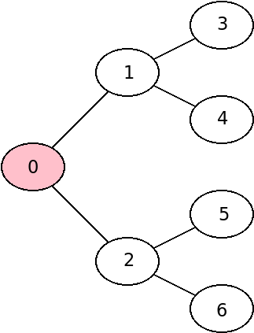
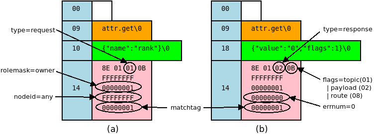
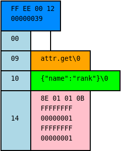

.. github display
   GitHub is NOT the preferred viewer for this file. Please visit
   https://flux-framework.rtfd.io/projects/flux-rfc/en/latest/spec_3.html

3/Flux Message Protocol
=======================

This specification describes the format of Flux message broker
messages, Version 1.

-  Name: github.com/flux-framework/rfc/spec_3.rst

-  Editor: Jim Garlick <garlick@llnl.gov>

-  State: draft

Language
--------

The key words "MUST", "MUST NOT", "REQUIRED", "SHALL", "SHALL NOT", "SHOULD",
"SHOULD NOT", "RECOMMENDED", "MAY", and "OPTIONAL" in this document are to
be interpreted as described in `RFC 2119 <https://tools.ietf.org/html/rfc2119>`__.

Related Standards
-----------------

- `ZeroMQ Message Transfer Protocol (ZMTP) <https://rfc.zeromq.org/spec:23/ZMTP>`_

Goals
-----

The Flux message protocol v1 provides a way for Flux utilities and services to
communicate with one another within the context of a flux instance. It has
the following specific goals:

-  Enable Flux components to communicate within a Flux instance.

-  Enable the remote procedure call communication idiom.

-  Enable the publish-subscribe communication idiom.

-  Allow Flux services to be deployed and accessed without consulting a
   location service.

-  Avoid sending Flux data over networks without encryption.

-  Allow messages to be propagated over different transports including, but
   not limited to, ZeroMQ.

-  Enable scalability to many thousands of nodes.

-  Implement failure mitigation strategies that are simple to reason about.

-  Ensure that messages between any pair of endpoints are received in
   transmission order.

Background
----------

The ``flux-broker`` is a message broker daemon for the Flux resource manager
framework.  A Flux *instance* is a set of ``flux-broker`` processes that
form an overlay network for distributed communication.  Flux components
communicate with each other by exchanging messages over the overlay network.

In a Flux instance of size *N*, each broker is assigned a rank from 0 to
*N - 1*.  The overlay network is a tree topology, with the root of the tree
at rank 0.  Different tree shapes are permitted as long as peer connections are
only between tree levels, and each node has at most one parent.  The tree
shape, the instance size, and each broker's rank are fixed once the instance
begins running.

   The Flux overlay network with root broker at rank 0.

The overlay network is capable of routing messages using several methods.
Messages may be routed over the shortest path between any two brokers, using
"smart host" routing where messages are forwarded upstream until a more
informed broker knows how to route it, or by multi-casting to all broker
ranks.  These capabilities support remote procedure call and
publish-subscribe, the two main communication idioms used in Flux.

If a broker fails or its connection is lost, any pending RPCs involving that
broker as a target or as a message router receive automatic error responses,
and the broker is forced to restart before reconnecting.  If the failed broker
is an interior node of the tree acting as a router, its entire sub-tree is
forced to restart.  In a Flux system instance, this restart is managed by
systemd.

Flux messages share a common structure that is strongly influenced by ZeroMQ
conventions, since ZeroMQ provides a transport for Flux messages, and certain
ZeroMQ socket types impose structural requirements on messages for routing
and subscription filtering.  Flux messages may be sent over other transports,
however.  For example, regular UNIX domain stream sockets transport messages
between local processes and Flux brokers.

There are four distinct Flux message types:  *request* and *response* messages
for remote procedure call;  *event* messages for publish-subscribe, and
*control* messages for internal use by the overlay network implementation.

Implementation
--------------

Rank Assignment
~~~~~~~~~~~~~~~

A *node* is defined as a ``flux-broker`` task. Each node in a Flux
instance of size N SHALL be assigned a rank in the range of 0 to N - 1.
Ranks SHALL be represented by a 32 bit unsigned integer, with the highest
value of (2:sup:`32` - 3).

The rank FLUX_NODEID_ANY (2:sup:`32` - 1) SHALL be reserved to indicate
*any rank* in addressing.

The rank FLUX_NODEID_UPSTREAM (2:sup:`32` - 2) SHALL be reserved to indicate
*any rank* that is upstream of the sender in request addressing.
This value is reserved for the convenience of API implementations
and SHALL NOT appear in the nodeid slot of an encoded message.

A node’s rank SHALL be assigned at broker startup and SHALL NOT change
for the node’s lifetime.

The size of the Flux instance SHALL be determined at startup and SHALL
not change for the life of the Flux instance. [Dynamic resize will
be covered in a future version of this specification.]

Overlay Networks
~~~~~~~~~~~~~~~~

The nodes of a Flux instance SHALL at minimum be interconnected in
tree based overlay network with rank 0 at the root of the tree.

The nodes of a Flux instance MAY be interconnected in additional
overlay networks to improve efficiency or fault tolerance.

Service Addressing
~~~~~~~~~~~~~~~~~~

A Flux service SHALL be identified in a request by a *topic string*,
a set of words delimited by periods, in which the first word identifies
the service, and remaining words represent *methods* within that service.
For example, "kvs.get" refers to the *get* method of the *kvs* service.

Default Request Routing
~~~~~~~~~~~~~~~~~~~~~~~

Request messages MAY be addressed to *any rank* (FLUX_NODEID_ANY).
Such messages SHALL be routed to the local broker, then to the
first match in the following sequence:

1. If topic string begins with a word matching a local broker module
   and the sender is not the same module attached to the same rank
   broker, the message SHALL be routed to the broker module.

2. If the broker is not the root node of the tree based overlay network,
   the message SHALL be routed to a parent node in the tree based overlay
   network, which SHALL re-apply this routing algorithm.

If the message is received by a broker module, but the remaining words of the
topic string do not match a method it implements, the module SHALL
respond with error number 38, "Function not implemented", unless suppressed
as described below.

If the message reaches the root node, but none of the above conditions
are met, the root broker SHALL respond with error number 38,
"Function not implemented", unless suppressed as described below.

A service may send a request *upstream* on the tree based overlay network
by placing the sending nodeid in the message and setting the
FLUX_MSGFLAG_UPSTREAM (16) flag. Such a message SHALL handled
by the broker as if it were addressed to FLUX_NODEID_ANY, except
that the message SHALL NOT be delivered on the sending node.

Rank Request Routing
~~~~~~~~~~~~~~~~~~~~

Request messages MAY be addressed to a specific rank.
Such messages SHALL be routed to the target broker rank, then as follows:

1. If topic string begins with a word matching a local broker module,
   the message SHALL be routed to the module.

If the message is received by a broker module, but the remaining words of the
topic string do not match a method it implements, the module SHALL
respond with error number 38, "Function not implemented", unless suppressed
as described below.

If the message reaches the target node, but none of the above conditions
are met, the broker SHALL respond with error number 38,
"Function not implemented", unless suppressed as described below.

If the message cannot be routed to the target node, the broker making
this determination SHALL respond with error number 113, "No route to host",
unless suppressed as described below.

Suppression of Responses
~~~~~~~~~~~~~~~~~~~~~~~~

If a request message includes the FLUX_MSGFLAG_NORESPONSE (4) flag,
the broker or other responding entity SHALL NOT send a response message.

Event Routing
~~~~~~~~~~~~~

Event messages SHALL only be published by the rank 0 broker. Other ranks MAY
cause an event to be sent by first forwarding it to rank 0.

Payload Conventions
~~~~~~~~~~~~~~~~~~~

Request, response, and event messages MAY contain a payload. Payloads MAY
consist of any byte sequence. To maximize interoperability, norms are
established for common payload types:

1. String payloads SHALL include a terminating NULL character.

2. Structured objects are RECOMMENDED to be represented as JSON [#f1]_.

3. JSON payloads SHALL conform to Internet RFC 7159.

4. JSON payloads SHALL be objects, not arrays or bare values.

5. JSON payloads SHALL include a terminating NULL character.

Message Structure
~~~~~~~~~~~~~~~~~

An individual message SHALL consist of a list of one or more variable
length message parts.  Flux messages SHALL consist of the following message
parts, in order:

routes (optional)
  Messages MAY contain a "route stack" for request/response message routing.
  Each route SHALL be a message part containing a UUID string that represents
  one route hop.  The most recent hop SHALL be on the top of the stack (first
  message part).

route stack delimiter (optional)
  The route stack delimiter is an empty message frame that delimits the route
  stack from other message parts.  The delimiter is REQUIRED if the message
  contains any routes.

topic string (optional)
  Messages MAY contain a period-delimited string representing an event topic
  or a RPC service endpoint.  The topic string is REQUIRED if the message type
  is a request, response, or event.

payload (optional)
  Messages MAY contain a payload of zero or more bytes of user-specific content.

PROTO block (required)
  The PROTO block is a 20-byte block of message data defined in the ABNF
  below.  Among other things, it contains message flags that indicate which
  of the optional message parts are present.

   Example of (a) Flux request message, and (b) Flux response message.  Integer
   values are in hex, and for clarity are not converted to network byte order.

Flux messages are specified by the following modified ABNF grammar [#f2]_

::

   message       = C:request *S:response
                   / S:event
                   / C:control

   ; Multi-part ZeroMQ messages
   C:request       = [routing] topic [payload] PROTO
   S:response      = [routing] topic [payload] PROTO
   S:event         = [routing] topic [payload] PROTO
   C:control       = PROTO

   ; Route frame stack, ZeroMQ DEALER-ROUTER format
   routing         = *identity delimiter
   identity        = 1*OCTET       ; socket identity ZeroMQ frame
   delimiter       = 0OCTET        ; empty delimiter ZeroMQ frame

   ; Topic string frame, ZeroMQ PUB-SUB format
   topic           = 1*(ALPHA / DIGIT / ".")

   ; Payload frame
   payload         = *OCTET        ; payload ZeroMQ frame

   ; Protocol frame
   PROTO           = request / response / event / control

   request         = magic version %x01 flags userid rolemask nodeid   matchtag
   response        = magic version %x02 flags userid rolemask errnum   matchtag
   event           = magic version %x04 flags userid rolemask sequence unused
   control         = magic version %x08 flags userid rolemask type     status

   ; Constants
   magic           = %x8E          ; magic cookie
   version         = %x01          ; Flux message version

   ; Flags: a bitmask of flag- values below
   flags           = OCTET
   flag-topic      = %x01          ; message has topic string frame
   flag-payload    = %x02          ; message has payload frame
   flag-noresponse = %x04          ; request message should receive no response
   flag-route      = %x08          ; message has route delimiter frame
   flag-upstream   = %x10          ; request should be routed upstream
                                   ;   of nodeid sender
   flag-private    = %x20          ; event message is requested to be
                                   ;   private to sender, instance owner
   flag-streaming  = %x40          ; request/response is part of streaming RPC

   ; Userid assigned by connector at message ingress
   userid          = 4OCTET / userid-unknown
   userid-unknown  = 0xFF.FF.FF.FF

   ; Role bitmask assigned by connector at message ingress
   rolemask        = 4OCTET

   ; Matchtag to correlate request/response
   matchtag        = 4OCTET / matchtag-none
   matchtag-none   = %x00.00.00.00

   ; Target node ID in network byte order
   nodeid          = 4OCTET / nodeid-any
   nodeid-any      = %xFF.FF.FF.FF

   ; UNIX errno in network byte order
   errnum          = 4OCTET

   ; Monotonic sequence number in network byte order
   sequence        = 4OCTET

   ; Control message type
   type            = 4OCTET

   ; Control message status
   status          = 4OCTET

   ; unused 4-byte field
   unused          = %x00.00.00.00

Message Framing and Security
~~~~~~~~~~~~~~~~~~~~~~~~~~~~

When Flux uses ZeroMQ for transport (overlay network peer connections and the
``shmem`` connector), ZeroMQ handles security and message framing.  When Flux
uses a UNIX domain stream socket for transport (``local`` connector), Flux
handles security and message framing as described below.  The remainder of
this section applies only to connection over UNIX domain stream sockets.

Upon accepting a connection from a new client, Flux SHALL determine the peer
identity using SO_PEERCRED and apply security policies described in RFC 12 to
determine if user is authorized to access Flux.  If the user is *denied*
access, a single nonzero byte representing a POSIX errno SHALL be sent to the
client.  When the client receives a nonzero errno byte, it SHOULD interpret
the error and disconnect.  If the user is *allowed* access, a single zero byte
SHALL be sent to the client.  Upon receipt of the zero byte, the client MAY
proceed to exchange Flux messages on the socket.

Messages SHALL be framed as follows:  First, within a message, message parts
SHALL be encoded as as a *size* field followed by a *data* field.  The *size*
field consists of a short message size (1 byte) followed by an optional long
message size (4 bytes).  The message sizes SHALL be interpreted as unsigned
integers in network byte order.

short message parts
  If the *data* field is from 0 to 254 bytes, its length SHALL be placed
  in the short message size.  The long message size SHALL be omitted.

long message parts
  If the *data* field is 255 bytes or greater, its length SHALL be placed in
  the long message size.  The short message size SHALL be set to a value of 255.

After the message parts are encoded and concatenated, the message SHALL be
prefaced with a 4 byte magic value of (``FF``, ``EE``, ``00``, ``12``) and
a 4-byte unsigned integer message length in network byte order.  The message
length SHALL be set to the size of the concatenated message parts, including
their length fields.

   Example of a Flux request message with framing for transmission over a
   UNIX domain stream socket.

.. [#f1] `RFC 7159: The JavaScript Object Notation (JSON) Data Interchange Format <https://www.rfc-editor.org/rfc/rfc7159.txt>`__, T. Bray, Google, Inc, March 2014.

.. [#f2] For convenience: the ``C:request``, ``S:response``, ``S:event``, and ``C:control`` ABNF non-terminals refer to multi-part messages, sent by client (C) or server (S). Message part *size* framing is not shown for clarity.
