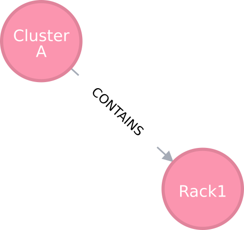
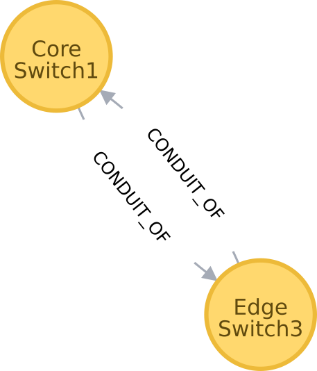

ifdef::env-github[:outfilesuffix: .adoc]

4/Flux Resource Model
=====================

The Flux Resource Model describes the conceptual model used for
resources within the Flux framework.

* Name: github.com/flux-framework/rfc/spec_4.adoc
* Editor: Mark Grondona <mgrondona@llnl.gov>
* State: draft

== Language

The key words "MUST", "MUST NOT", "REQUIRED", "SHALL", "SHALL NOT", "SHOULD",
"SHOULD NOT", "RECOMMENDED", "MAY", and "OPTIONAL" in this document are to
be interpreted as described in http://tools.ietf.org/html/rfc2119[RFC 2119].

== Related Standards

link:spec_14{outfilesuffix}[14/Canonical Job Specification]

== Goals

The Flux Resource Model provides a common conceptual model for resources
described and managed by the Flux framework and its components. The
goals of this model are to:

* Develop a generalized, extensible model for resources within the framework
  such that all present and future resource types fit the model
* Provide a common configuration scheme for these resources
* Provide a common storage, access, modification and discovery APIs for
  managing resource information

== Background

As in traditional resource management software, the Flux framework
requires a method for the description, configuration, tracking, and
assignment of consumable and other resources in the system
being managed. The Flux Framework, however, requires a more generalized and
flexible definition of resources and overall approach. This document
describes the basic concepts used to describe each individual
resource and its relationship with other resources. Further, it illustrates
how Flux uses these concepts to model some of the common high performance
computing (HPC) resources in relation to other resource management components.
We term the model for describing resources in Flux
_The Flux Resource Model_.

== The Flux Resource Model

The Flux Resource Model combines two basic concepts to describe
individual resources and various relationships among them.

The concept to describe each identifiable resource is called
_resource pool_. A resource pool is a group of one or more
_indistinguishable_ resources of a same kind. Each resource
in a pool cannot be individually identified, and therefore,
the resources in the pool are collectively represented as a
quantity. 32GB memory on a compute node, for instance, MAY be
described as a memory-resource pool with its pool size being
32 (i.e., 32 equal chunks of 1 GB memory). 

One of the benefits of introducing the pool concept is flexibility
in describing a resource with different levels of detail.
When a resource needs to described at coarse granularity,
it can be pooled together with other resources of the same type.
Conversely, when finer granularity is required, it can be promoted
to its own individual pool. If the compute node consists of 2 sockets
and non-uniform memory access performance between them is an important
consideration, 32GB memory can be modeled as 2 distinct memory-resource
pools instead, each on a socket with its pool size being
16 (i.e., 16 equal chunks of 1 GB memory).

A resource pool with size 1 SHALL be the finest granularity at which
a resource can be described.
Although this is identical to describing the resource as a scalar, we
SHALL still call it a resource pool to avoid introducing a new concept.
When a distinction is needed, a pool with size 1 SHALL be called
a ``degenerate resource pool''.

The second concept borrows from graph theory to describe relationships
among such individual resource pools. A graph consists of
a set of vertices and edges, where each vertex represents
an individual resource pool and an edge a certain relationship
between them.

Each edge SHALL be either directional or bidirectional
and have a type as well as a subsystem name such that the union
of the set of all edges with a same name and the set of all vertices
connected by these edges SHALL represent a unique subsystem
of resources (e.g., a compute subsystem, a parallel
I/O subsystem, a power subsystem, etc).

=== Resource Pool Data Model

This section describes the resource pool data required
to be stored, tracked, and queried.
Resource pool data SHALL be composed of base data and
OPTIONAL extended data. The base data captures the static
properties of the resource pool instance being modeled so
that it SHALL include, but be not limited to:

* Type
* UUID (Unique ID for this resource)
* Basename
* Name
* ID (OPTIONAL numeric ID to be appended to basename to get name)
* Properties (static properties associated with this instance)
* Size (Total number of resources in this pool)
* Units (OPTIONAL units associated with the `size` value)

The default value for `basename` SHALL be the `type`. The default value for
`name` SHALL be a concatenation of `basename` and `ID`, or just `basename`
when the `ID` value is not assigned.

The value for `name` SHALL support arbitrary resource attributes and
properties (e.g. a system might have node names formatted like
"node-${frameid}-${rack}").

The value for `properties` SHALL support multiple identifying
properties which could be used to uniquely characterize the resource.

On the other hand, the OPTIONAL extended data SHALL enable a user,
typically a management service such as a scheduler, to extend,
store and update its own data along with the base data of
the target resource pool instance.

It MAY include, but be not limited to:

* Tags (dynamic list of tags)
* State (e.g., up, down, degraded, failing, unknown, null)
* Scheduling state data such as job allocations and reservations

=== Graph Data Model

A graph consists of a set of vertices and edges.
The Flux Resource Model uses a vertex to represent a resource pool.
However, it is RECOMMENDED to avoid embedding all of the resource
pool data (i.e., base and extended data) directly into the vertex itself.
Instead, only a minimal set of metadata on the resource pool is
RECOMMENDED to be embedded directly within to the vertex
while keeping a reference to the pool data itself. The metadata
MAY pertain to traversal and search optimization: e.g.,
optimizing the retrieval of vertices of certain types
of resources, speeding up graph traversal by eliminating
unnecessary descents of a tree graph, etc.

An edge SHALL have data indicating its direction(s), type and belonging
subsystem name. The direction and type of an edge SHALL provide
a semantic meaning to the relationship between its connecting
vertices, and the name SHALL identify a subsystem this edge
belongs to.

.An edge capturing a ``has-a'' relationship

As shown in Figure 1, for example, the edge of the ``CONTAINS''
type represents the ``has-a'' relationship: i.e., Cluster A has a rack
called Rack1.

.Edges representing ``conduit-of'' relationships

Similarly, as shown in Figure 2, each edge of ``CONDUIT_OF''
type represents a directional flow relationship: i.e.,
EdgeSwitch3 is a conduit of CoreSwitch1 through which
data flows. A bidirectional relationship MAY be represented
either as a single edge with arrows in the both ends
or two opposite directional edges.

.Opposite relationship
image::data/spec_4/basics_in.png[width=200]

A directional relationship MAY be accompanied
not only by the same type but also by the opposite type
in the opposite direction.
For example, a directional ``CONTAINS'' edge MAY be accompanied
by an ``IN'' edge in the other direction, as shown in Figure 3.

Finally, the subsystem name of an edge SHALL be given such that the union of the
set of all edges annotated with a same name and the set of
all vertices connected by these edges represent a subsystem of resources.
Both edges in Figure 3 MAY be named "physical hierarchy"
if this graph belongs to that named hierarchy. Similarly, if the graph
shown in Figure 2 is a part of the I/O data path of a parallel file system,
PFS1, its name MAY be "PFS1 I/O bandwidth hierarchy."

== Common Patterns

The Flux Resource Model SHALL support a range of resource sets, from
all of the resources in the center
to a small subset allocated to one Flux instance.
In addition, the Flux Resource Model SHALL support management
operations at multiple granularity.
In such a scheme, the higher the Flux instance is
in the Flux instance hierarchy, the coarser resource granularity it MAY be
configured to operate at. For example, a higher-order Flux instance
MAY be configured to operate at the racks and aggregates on their
containing nodes while a lower-level instance MAY actually operate at
the nodes and cores as the finest resource granularity.

The following provides common examples to illustrate how Flux composes
two basic concepts to model some of the common HPC resources.

=== The Composite Resource Pool

The dominant form of the Flux Resource Model is called
_composite resource pool_, the combination of a _composite type_
(i.e., resources with 0 or more children and at most one parent,
arranged in a hierarchical ``has-a'' graph relationship),
and a _resource pool_.

Borrowing from an object-oriented design pattern,
the composite resource pool leads to the natural representation of
resources as a hierarchy of individual or pooled resources
bound to a _root_ which will typically be a ``cluster'' or ``center''
resource.

.Modeling a containment hierarchy using the composite resource pool
image::data/spec_4/in.png[width=350]

Figure 4 shows a simple example of a composite resource pool
representing a compute-hardware containment hierarchy.

Use of the composite resource pool in Flux has the following properties:

* Groups of related resources are treated the same as a single instance
* A subset of a composite resource pool is a valid composite resource pool
* Composite resource naturally describes resources in a ``has-a'' relationship
* High level resources can be created piece-wise from base resource types.

=== The Channeled Resource Pool

As HPC centers are becoming increasingly data- and power-constrained,
the Flux Resource Model MUST be flexible to be able to model
how data and/or power flow through its distribution units (e.g.,
a high performance switch for data and a power distribution unit for power).
One specific form of the Flux Resource Model to represent
the notion of a flow is called _channeled resource pool_. Here,
two resource pool instances, each representing a distribution capacity
of a flow, are related under a _channel-of_ or _conduit-of_ relationship.

.Modeling a file I/O bandwidth hierarchy using the channeled resource pool
image::data/spec_4/channel_of.png[width=200]

Figure 5 shows how the I/O bandwidth subsystem of a parallel file
system, PFS1, can be modeled using this form. The resource pool in
each vertex describes its distribution capacity and each edge represents
which direction data is distributed to.

Using this representation, an I/O bandwidth-aware scheduler
MAY allocate the bandwidth capacity required by a job
on all of the distribution units that lie along the data path
up to PFS1 when the platform is I/O bandwidth-constrained.

=== Unifying Different Patterns under the Same Model
Because any specialized form of a resource subsystem SHALL be
itself built out of the same basic concepts, the Flux Resource Model
SHALL be capable of easily combining different patterns into a unified form.

.Unified graph
image::data/spec_4/combined.png[width=450]

Figure 6 shows how the above two different forms of the Flux Resource Model
can be seamlessly represented under the same paradigm.
While simple, this example shows how the Flux Resource Model
generalizes ways to model any resources, their individual
relationships, and perhaps more importantly subsystems
of these resources.

== Abstract Interfaces

The abstract interfaces of the Flux Resource Model SHALL
include, but not be limited to the following.
These interfaces are again broken down by two fundamental
concepts of the Flux Resource Model: resource pool and graph.
The implementors of the Flux Resource Model MAY
use this as a guide to determine the proper abstraction
level exposed by the implementations.

=== Resource Pool

When operating on a resource pool as an object, the following methods
SHALL be supported. The majority of methods are accessors.

Getters:: Query both the base and extended data
  of the resource pool, including its size.

Setters:: Update certain base and extended data, which
  includes ``Tag (K, [V])'', a method for tagging a resource pool
  object with arbitrary key (K) and OPTIONAL value (V) pairs, if
  the extended data includes Tags, and ``State'', a method for setting
  the state of the resource, if state is included in the extended data.

Matching support:: Support various comparison operations from the filters
  that are being invoked by a walker (See the Graph subsection). Getters SHALL
  expose sufficiently detailed information so the evaluating
  filter can match on both base and extended data (e.g., tags,
  properties, size, type, name, basename, ids, etc).

=== Graph
The following are the primary abstract types and their
roles as relevant to the graph.

Walker:: Provide generic ways to traverse the graph, visiting
  a subset of its vertices with a specific traversal pattern.
  It is passed in the starting vertex and the name of a subsystem
  (e.g., the root vertex of a compute-hardware containment hierarchy
  or an I/O bandwidth hierarchy) from which to walk.
  In particular, on a tree hierarchy, preorder and postorder
  visiting patterns SHALL be supported, and a user MAY be able to
  register with it pre- and/or post-order callbacks, or ``filters'',
  which are invoked by the walker on each visit event.
  The filters MAY be passed in either from within the same
  service space or from a remote service space.
  The implementation that supports the remote filter passing
  facilitates providing the the Flux Resource Model as a standalone
  ``Resource'' service.

Pruning Filter:: Allow a user of the walker to continue
  or stop further traversal from the visiting vertex.
  On a tree hierarchy, this filter is called back by the walker
  on each preorder visit event, and its return code influences
  the walker's next traversal action.

Evaluating Filter:: Allow a user to evaluate the resource pool data
  of the visiting vertex. In particular, on a tree hierarchy,
  it is invoked by the walker on each postorder visit event.
  This filter will typically calculate the matching score
  of the visiting vertex, and if the score satisfies the criteria,
  it pushes the vertex into an accumulator that is capable of
  tracking the selected vertices in descending score order.
  In addition, an evaluating filter can initiate a new sub-walk
  into connecting vertices that belong to a subsystem different
  from the currently walking subsystem.
  In this case, a different walker and filters MAY be used.

Accumulator:: Allow an evaluating filter to store
  and keep the matching vertices in their sorted score order.

Serializer:: Allow for serializing/deserializing a subset
 of vertices along with their resource pool data.
 Allow for transmission of this data over the wire,
 saving state to a file, etc.

