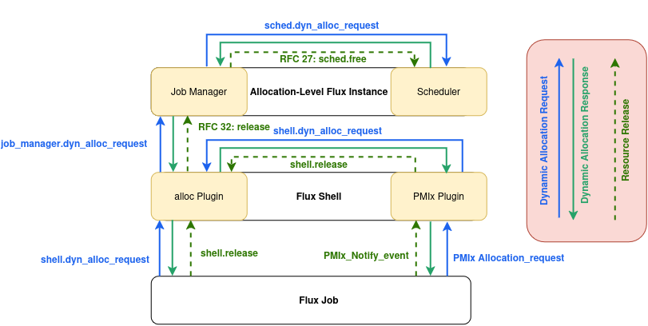

51/Flux Resource Allocation Protocol Version 2
################################################

This specification describes Version 2 of the Flux Resource Allocation Protocol implemented by the shell, job manager and a compliant Flux scheduler.

.. list-table::
  :widths: 25 75

  * - **Name**
    - github.com/flux-framework/rfc/spec\_51.rst
  * - **Editor**
    - Dominik Huber \<domi.huber\@tum.de>
  * - **State**
    - raw

Language
********

.. include:: common/language.rst

Related Standards
*****************

- :doc:`spec_3`
- :doc:`spec_14`
- :doc:`spec_16`
- :doc:`spec_20`
- :doc:`spec_21`
- :doc:`spec_23`
- :doc:`spec_25`
- :doc:`spec_27`

Background
**********

Flux Resource Allocation Protocol Version 2 supports two types of resource 
allocations: **static** and **dynamic** allocations.

Static Resource Allocation
==========================

.. note::

  Copy Background from RFC 27 here

Dynamic Resource Allocation
===========================

Dynamic Resource Management (DRM) allows dynamic changes to a job's resource 
allocation during runtime.
Such changes are achieved through **dynamic reallocation operations**, 
(i.e. modifications of the Flux Resource Set such as adding and/or removing 
resources).
To coordinate such dynamic reallocation operations, a communication mechanism 
between jobs and schedulers involving the shell and job manager is required.

Conceptually, the envisioned mechanism consists of these steps:

1. **Dynamic allocation request:** Jobs indicate support for dynamic 
reallocation operations towards the scheduler. For simplicity, we refer to 
this as **dynamic allocation request**, although it more generally 
describes **a space of possible reallocation actions** supported by the 
job (e.g. supported range of number of resources, supported resource types, 
...) **coupled with optimization information** (e.g. performance models, 
urgency, ...).

.. note::

  TODO: The representation of optimization information might be specified in a 
  separate RFC

2. **Dynamic allocation response:** The scheduler eventually responds with
a concrete reconfiguration decision towards jobs, which lies within the 
constraints specified in the request.

3. **Resource release**: Resource release requires an additional step, in 
which jobs explicitly release resources back to the system.

In this context, the Flux job shell provides the job-local execution and 
control context through which processes running in a Flux job interact 
with the Flux runtime.
It hosts job-facing interfaces (possibly through the PMIx plugin) and 
translates or forwards dynamic allocation messages between the application 
and the Flux job manager.

.. note::
  The communication mechanism defined in this RFC is based on the 
  ``PMIx_Allocation_request`` and is therefore not supported by the PMI-1 
  wire protocol.

In addition to it's role managing state transitions as indicated in RFC 27, 
the  Flux job manager now also mediates dynamic allocation requests.

A Flux scheduler's role is passively processing dynamic resource allocation 
messages sent by the job manager on behalf of jobs.

A high-level overview is provided in the following figure.

  Overview of dynamic allocation communication.

A Flux Job triggers a dynamic reallocation either through the PMIx plugin with 
a ``PMIx_Allocation_request`` which sends a dynamic allocation request to the 
shell's ``alloc`` plugin with a ``shell.dyn_alloc_request``, or directly 
through a ``shell.dyn_alloc_request``.

The Flux shell sends a dynamic reallocation request to the local job manager 
with a ``job_manager.dyn_alloc_request``. The job manager then forwards the 
request on behalf of the Flux shell to the local scheduler with a 
``sched.dyn_alloc_request``.

A simple scheduler satisfies ``sched.dyn_alloc_request`` requests by the 
first-in-first-out principle.
More complex schedulers MAY consider multiple ``sched.dyn_alloc_request`` requests 
and process them out of order to prioritize or balance measures of success 
such as resource utilization or fairness.

The response from the scheduler contains a concrete reallocation action to 
adapt a job's resource set and is processed by the job manager by applying 
required changes to the job. This includes adding any additionally provided 
resources to the job's resource set and sending a response for the 
outstanding dynamic allocation request to the shell.

The response from the job manager is processed by the shell by applying 
required changes to the job runtime environment. This includes sending a 
response for the outstanding dynamic allocation request to the job or PMIx 
plugin.

Since removing resources requires prior adaptation of the job (such as 
terminating processes on the indicated resources), the actual release of 
resources from a job's resource set is deferred until explicitly released 
by the job with a ``shell.release``.

When the shell receives a ``shell.release`` and corresponding job and shell 
processes have terminated, the job execution service responds with a 
``release`` response (with ``final=false``) to the streaming RPC defined in 
RFC 32 to release resources back to the job manager.

The job manager then releases resources back to the scheduler with a 
``sched.free`` call as defined in RFC 27.

Abstract, dynamic resource allocation requests are expressed as a **jobspec** 
object (RFC 25 or later). Concrete resource assignments are expressed as an 
**R** object (RFC 20 or later). These objects are stored in the KVS per the 
job schema (RFC 16).

When adding or removing resources to/from a job's allocation, the Flux job 
manager SHALL emit corresponding job lifecycle events such as ``alloc``, 
``resource-update``, ``release``, and ``free`` (RFC 21).

This RFC describes the RPC messages outlined above.

Design Criteria
***************

.. note::

  Copy "Design Criteria" from RFC 27 here

- Support dynamic allocations

Implementation
**************

.. note::

  Copy "Implementation" from RFC 27 here

Dyn. Alloc Request (Jobs)
=========================

Jobs (i.e. shell processes) MAY send a ``shell.dyn_alloc_request`` message to 
indicate support for a dynamic reallocation action.
The request payload consists of a JSON object with the following REQUIRED keys:

alloc_ref_id
  (integer) User assigned id to reference this request e.g., in a CANCEL 
  request.

Exactly one of ``resource_ref_id`` and ``resource_ref`` SHALL be provided.
``resource_ref_id`` identifies a resource fragment previously referenced by 
the scheduler.
``resource_ref`` specifies the concrete R to be referenced.

resource_ref
  (object) R object (RFC 20 or later) referencing a certain set of resources 
  this request applies to.

resource_ref_id
  (integer) R fragment id referencing a certain set of resources this request 
  applies to.

.. note::

  TODO: Such an id for R fragments might be part of R version 2.

directive
  (integer) Dynamic allocation directive

The following two allocation directives SHALL be supported.
Additional directives MAY be supported.

REALLOC (0)
  Resources might be added and/or removed

CANCEL (1)
  Cancel a dynamic allocation request

If directive is REALLOC at least one of the following keys is REQUIRED:

spec_add
  (object) jobspec object (RFC 25 or later) matching resources to be added

spec_sub
  (object) jobspec object (RFC 25 or later) matching a subset of job resources 
  to be removed.

If directive is CANCEL the following key is REQUIRED:

alloc_cancel_id
  (integer) Alloc ID of existing allocation request to cancel

Example for an REALLOC request submitted by a Flux Job to support the 
addition of four nodes with two cores each:

.. code-block:: json

  {
     "directive": 0,
     "alloc_ref_id": 123,
     "resource_ref": {
        "version": 1,
        "execution": {
           "R_lite": [
              {
                 "rank": "0-1",
                 "children": {
                    "core": "0-3"
                 }
              }
           ]
        }
     },
     "spec_add": {
        "version": 1,
        "resources": [
           {
              "type": "node",
              "count": 4,
              "with": [
                 {
                    "type": "slot",
                    "count": 1,
                    "label": "default",
                    "with": [
                       {
                          "type": "core",
                          "count": 2
                       }
                    ]
                 }
              ]
           }
        ],
        "tasks": [
           {
              "command": ["app"],
              "slot": "default",
              "count": {
                 "per_slot": 1
              }
           }
        ],
        "attributes": {
           "system": {
              "duration": 3600.0,
              "cwd": "/home/flux",
              "environment": {
                 "HOME": "/home/flux"
              }
           }
        }
     }
  }

The response payload is a JSON object with the following REQUIRED keys:

alloc_id
  (integer) Unique ID assigned to this request by the scheduler

type
  (integer) response type in the range of 0 through 2

There are three response types:

SUCCESS (0)
  Scheduler has decided on a resource reallocation action

DENY (1)
  The dynamic allocation cannot be processed

CANCEL (2)
  The dynamic allocation request was canceled by a ``sched.cancel`` request

If response type is SUCCESS, at least one of the following additional keys is 
REQUIRED:

R_delta_add
  (object) R object (RFC 20 or later) describing resources to be added.

R_delta_sub
  (object) R object (RFC 20 or later) describing resources to be removed.

If resources are added, these resources are available for use by the job upon 
returning from this call.

Conversely, if resources are to be removed, the Flux job is expected to first 
terminate all its processes on the indicated set of resources and to call 
``shell.release`` after which the job execution service releases the R 
fragment to the job manager with a ``release`` response as defined in RFC 32.

Example of a SUCCESS response for a REALLOC request:

.. code-block:: json

  {
      "alloc_id": 12321234,
      "type": 0,
      "R_delta_add": {
         "version": 1,
         "execution": {
            "R_lite": [
               {
                  "rank": "19-22",
                  "children": {
                     "core": "0-47",
                     "gpu": "0-7"
                  }
               }
            ],
            "nodelist": [
               "node[186-189]"
            ],
            "nslots": 32,
            "starttime": 1676560542,
            "expiration": 1676562342
         }
      }
  }

Dyn. Alloc Request (Shell)
==========================

The shell SHALL send a ``job_manager.dyn_alloc_request`` request when 
receiving a dynamic allocation request from a job.

The request payload consists of a JSON object with the following REQUIRED keys:

alloc_ref_id
  (integer) User assigned id to reference this request e.g., in a CANCEL request.

job id
  (integer) ID of the job this request relates to.

Exactly one of ``resource_ref_id`` and ``resource_ref`` SHALL be provided.
``resource_ref_id`` identifies a resource fragment previously referenced by 
the scheduler.
``resource_ref`` specifies the concrete R to be referenced.

resource_ref
  (object) R object (RFC 20 or later) referencing a certain set of resources 
  this request applies to

resource_ref_id
  (integer) R fragment id referencing a certain set of resources this request 
  applies to

.. note::

  TODO: Such an id for R fragments might be part of R version 2.

directive
  (integer) Dynamic allocation directive

The following two allocation directives SHALL be supported.
Additional directives MAY be supported.

REALLOC (0)
  Resources might be added and/or removed

CANCEL (1)
  Cancel a dynamic allocation request

If directive is REALLOC at least one of the following keys is REQUIRED:

spec_add
  (object) jobspec object (RFC 25 or later) matching resources to be added

spec_sub
  (object) jobspec object (RFC 25 or later) matching a subset of job resources 
  to be removed

If directive is CANCEL the following key is REQUIRED:

alloc_cancel_id
  (integer) Alloc ID of existing allocation request to cancel

Example for an REALLOC request forwarded by the shell to support the 
addition of four nodes with two cores each:

.. code-block:: json

  {
     "directive": 0,
     "alloc_ref_id": 123,
     "job_id": 42,
     "resource_ref": {
        "version": 1,
        "execution": {
           "R_lite": [
              {
                 "rank": "0-1",
                 "children": {
                    "core": "0-3"
                 }
              }
           ]
        }
     },
     "spec_add": {
        "version": 1,
        "resources": [
           {
              "type": "node",
              "count": 4,
              "with": [
                 {
                    "type": "slot",
                    "count": 1,
                    "label": "default",
                    "with": [
                       {
                          "type": "core",
                          "count": 2
                       }
                    ]
                 }
              ]
           }
        ],
        "tasks": [
           {
              "command": ["app"],
              "slot": "default",
              "count": {
                 "per_slot": 1
              }
           }
        ],
        "attributes": {
           "system": {
              "duration": 3600.0,
              "cwd": "/home/flux",
              "environment": {
                 "HOME": "/home/flux"
              }
           }
        }
     }
  }

The response payload is a JSON object with the following REQUIRED keys:

alloc_id
  (integer) Unique ID assigned to this request by the scheduler

type
  (integer) response type in the range of 0 through 2

There are three response types:

SUCCESS (0)
  Scheduler has decided on a resource reallocation action

DENY (1)
  The dynamic allocation cannot be processed

CANCEL (2)
  The dynamic allocation request was canceled by a ``sched.cancel`` request

If response type is SUCCESS, at least one of the following additional keys is 
REQUIRED:

R_delta_add
  (object) R object (RFC 20 or later) describing resources to be added

R_delta_sub
  (object) R object (RFC 20 or later) describing resources to be removed

If resources are to be removed, the Flux shell SHALL wait until all job 
shells on the indicated set of resources have terminated and a corresponding 
``shell.release`` call has been received, after which the job execution 
service releases the R fragment to the job manager with a ``release`` 
response (RFC 32).

Example of a SUCCESS response to an EXTEND request:

.. code-block:: json

  {
      "alloc_id": 12321234,
      "type": 0,
      "R_delta_add": {
         "version": 1,
         "execution": {
            "R_lite": [
               {
                  "rank": "19-22",
                  "children": {
                     "core": "0-47",
                     "gpu": "0-7"
                  }
               }
            ],
            "nodelist": [
               "node[186-189]"
            ],
            "nslots": 32,
            "starttime": 1676560542,
            "expiration": 1676562342
         }
      }
  }

Dyn. Alloc Request (Job Manager)
================================

The job manager SHALL send a ``sched.dyn_alloc_request`` request when 
receiving a dynamic allocation request from a shell.

The request payload consists of a JSON object with the following 
REQUIRED keys:

job id
  (integer) ID of the job this request relates to

alloc_ref_id
  (integer) User assigned id to reference this request e.g., in a CANCEL 
  request

Exactly one of ``resource_ref_id`` and ``resource_ref`` SHALL be provided.
``resource_ref_id`` identifies a resource fragment previously referenced by 
the scheduler.
``resource_ref`` specifies the concrete R to be referenced.

resource_ref
  (object) R object (RFC 20 or later) referencing a certain set of resources 
  this request applies to

resource_ref_id
  (integer) R fragment id referencing a certain set of resources this request 
  applies to

.. note::

  TODO: Such an id for R fragments might be part of R version 2.

directive
  (integer) Dynamic allocation directive

The following two allocation directives SHALL be supported.
Additional directives MAY be supported.

REALLOC (0)
  Resources might be added and/or removed

CANCEL (1)
  Cancel a dynamic allocation request

If directive is REALLOC at least one of the following keys is REQUIRED:

spec_add
  (object) jobspec object (RFC 25 or later) matching resources to be added

spec_sub
  (object) jobspec object (RFC 25 or later) matching a subset of job resources 
  to be removed.

If directive is CANCEL the following key is REQUIRED:

alloc_cancel_id
  (integer) Alloc ID of existing allocation request to cancel

Example for an REALLOC request forwarded by the job manager to the scheduler 
to support the addition of four nodes with two cores each:

.. code-block:: json

  {
     "directive": 0,
     "alloc_ref_id": 123,
     "job_id": 42,
     "resource_ref": {
        "version": 1,
        "execution": {
           "R_lite": [
              {
                 "rank": "0-1",
                 "children": {
                    "core": "0-3"
                 }
              }
           ]
        }
     },
     "spec_add": {
        "version": 1,
        "resources": [
           {
              "type": "node",
              "count": 4,
              "with": [
                 {
                    "type": "slot",
                    "count": 1,
                    "label": "default",
                    "with": [
                       {
                          "type": "core",
                          "count": 2
                       }
                    ]
                 }
              ]
           }
        ],
        "tasks": [
           {
              "command": ["app"],
              "slot": "default",
              "count": {
                 "per_slot": 1
              }
           }
        ],
        "attributes": {
           "system": {
              "duration": 3600.0,
              "cwd": "/home/flux",
              "environment": {
                 "HOME": "/home/flux"
              }
           }
        }
     }
  }

The response payload is a JSON object with the following REQUIRED keys:

alloc_id
  (integer) Unique ID assigned to this request by the scheduler

type
  (integer) response type in the range of 0 through 2

There are three response types:

SUCCESS (0)
  Scheduler has decided on a resource reallocation action

DENY (1)
  The dynamic allocation cannot be processed

CANCEL (2)
  The dynamic allocation request was canceled by a ``sched.cancel`` request

If response type is SUCCESS, at least one of the following additional keys is 
REQUIRED:

R_delta_add
  (object) R object (RFC 20 or later) describing resources to be added

R_delta_sub
  (object) R object (RFC 20 or later) describing resources to be removed

If resources are to be removed, the Flux job manager SHALL wait until the job 
execution service sends a ``<service>.release``, after which it SHALL send 
one or more sched.free requests to release allocated resources to the 
scheduler (RFC 27).

Example of a SUCCESS response for a REALLOC request:

.. code-block:: json

  {
      "alloc_id": 12321234,
      "type": 0,
      "R_delta_add": {
         "version": 1,
         "execution": {
            "R_lite": [
               {
                  "rank": "19-22",
                  "children": {
                     "core": "0-47",
                     "gpu": "0-7"
                  }
               }
            ],
            "nodelist": [
               "node[186-189]"
            ],
            "nslots": 32,
            "starttime": 1676560542,
            "expiration": 1676562342
         }
      }
  }

Resource Release (Jobs)
=======================

Flux jobs call ``shell.release`` to release resources back to the system.

This could either be a release of resources to complete a reconfiguration 
action received in response to a dynamic allocation request or an 
independent release of resources.

The job execution system / job shell tracks process termination on the 
resources referred to by ``shell.release`` and, once processes have 
terminated, releases the R fragment to the job manager with a ``release`` 
response as defined in RFC 32.

Upon receiving the ``release`` response, the job manager sends an RFC 27 
``sched.free`` request to release the resources to the scheduler accordingly.

The request payload consists of a JSON object with EXACTLY ONE of the 
following keys:

alloc_id
  (integer) Allocation id referencing the scheduler decision this resource 
  release fulfills

resources
  (object) R fragment specifying the resources to be released

Example: Releasing 8 cores, 4 associated with broker rank 0 on node1 and 4 
associated with broker rank 1 on node1 respectively.

.. code-block:: json

  {
      "version": 1,
      "execution": {
         "R_lite": [
            {
               "rank": "0-1",
               "children": {
                  "core": "0-3"
               }
            }
         ],
         "nodelist": [
            "node[1-2]"
         ]
      }
  }